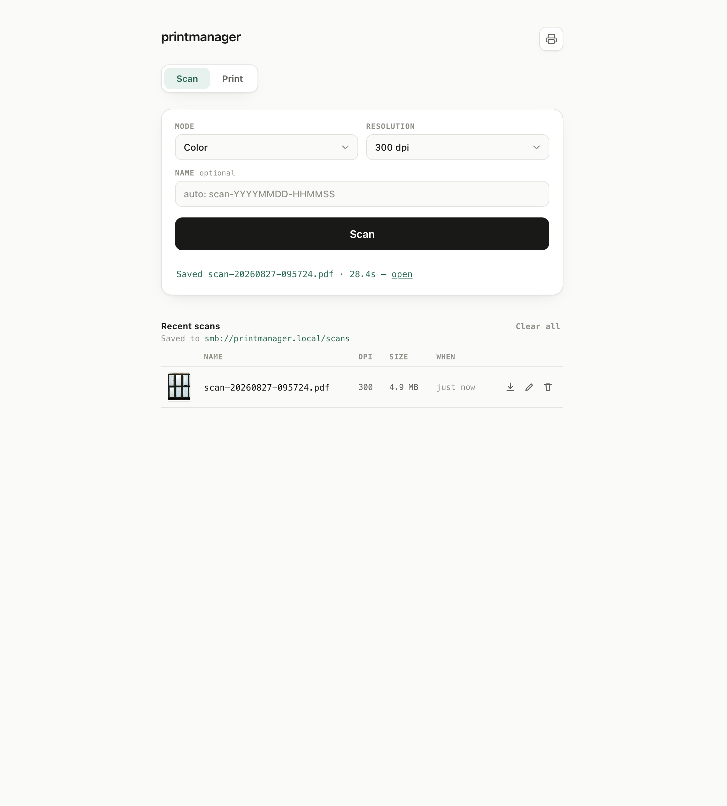
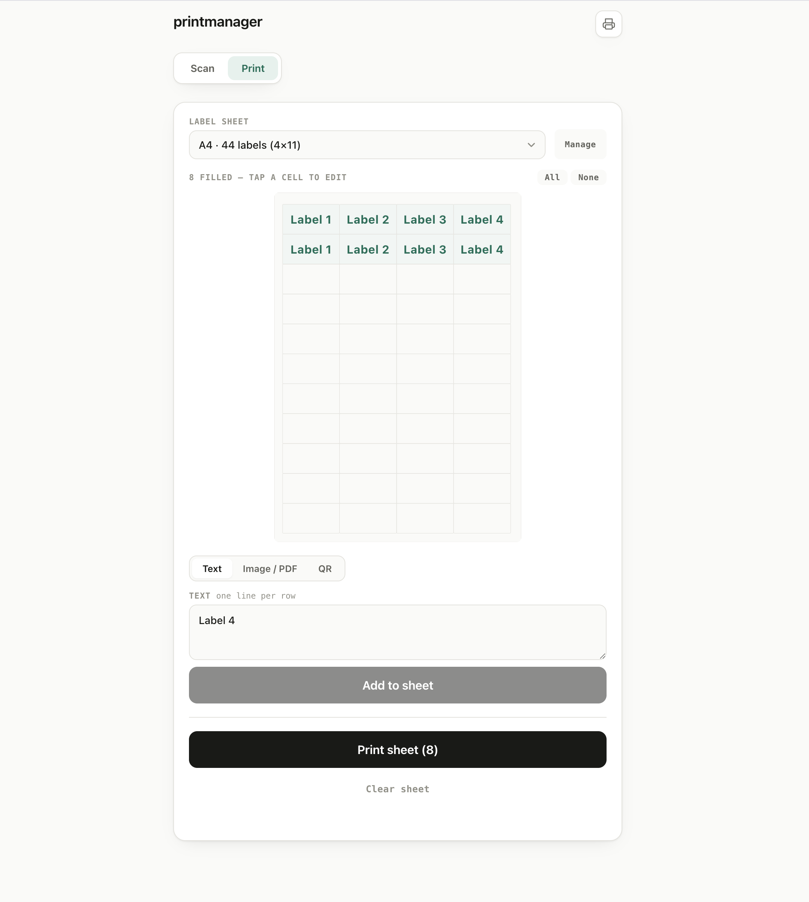
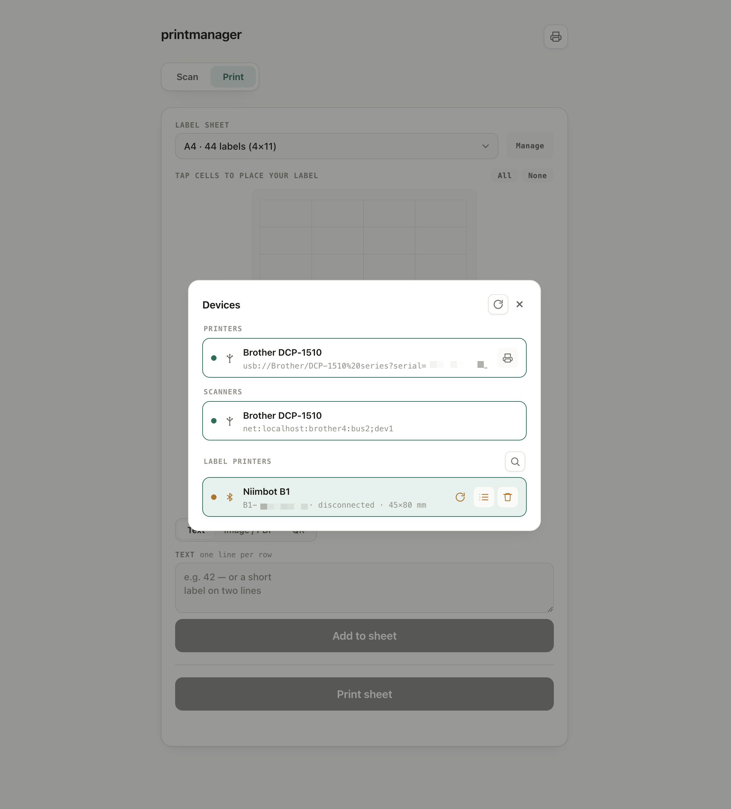

# printmanager

Turns a single-board computer (a Raspberry Pi, or any Ubuntu/Debian box) into a
**print + scan + label server** on your LAN, provisioned with
[Tack](https://github.com/tackhq/tack) (an Ansible-compatible config tool).

It bridges a USB-only **Brother DCP-1511** onto the network (AirPrint + eSCL scan
+ SMB share), and adds a web UI that also drives **Niimbot D110 / B1 Bluetooth
label printers**. Everything is reproducible from the `roles/` here and is
designed to run the same on **Raspberry Pi OS (Debian)** and **Ubuntu**.

## Features

| Area | What you get |
| --- | --- |
| **LAN printing** | CUPS shared over **AirPrint** (mDNS/IPP) — Apple/iOS/mobile print with no driver. **Config-driven**: declare one or more printers in a `printers:` list, each **driverless** (IPP Everywhere) or a named driver (the USB Brother DCP-1511 ships as a `brlaser` example). |
| **Scanning** | **Selectable backend**: driverless **eSCL** (`sane-airscan`, zero drivers) for modern scanners, or — the shipped default — Brother's real `brscan4` under **i386 emulation** (pixel-perfect) for driver-only units like the DCP-1511, republished as **eSCL/AirScan** for native macOS Image Capture / iOS. |
| **Searchable scans** | Every scan gets an invisible **OCR** text layer (ocrmypdf/Tesseract), configurable languages. |
| **Scan storage** | Scans land in a cross-platform **Samba share** (`\\printmanager.local\scans`), auto-pruned after a retention window. |
| **Label printers** | **Niimbot D110 / B1** over **Bluetooth LE** — discover, connect, one-click reconnect, and print **text / QR / image** labels sized to the roll. |
| **Web UI** | A single stdlib-Python app on port 80: **Scan**, **Labels** (a size-first format picker → A4 sheets *or* Niimbot labels, with a live **preview**), **Print** (PDF/image/text documents, a selectable **page range**, single- or **double-sided** incl. guided manual duplex), and a **Devices** manager. |
| **Device manager** | A gear-menu inventory of *all* hardware (CUPS printers, SANE scanners, USB, Bluetooth) with traffic-light status, a **test page** per printer, forget, and a per-device connection log. |
| **Self-healing** | A hardware watchdog reboots the box if it hangs, plus a connectivity self-heal that bounces Wi-Fi (and reboots as a last resort) if the network wedges. |
| **Hardened base** | Default-deny `iptables` firewall (LAN-scoped service ports), Wi-Fi power-save disabled (stops the radio stalling), ICMP allowed, portable locale setup. |

## Architecture

Tack applies a set of roles (in `site.yaml` order) to the host over SSH:

```
base ──> watchdog ──> print-server ──> scan-share ──> scan-server ──> web-ui
```

- **base** — common packages, the `iptables` default-deny firewall (SSH allowed
  first to avoid lockout; ICMP + per-service LAN rules inserted above the DROP),
  Wi-Fi power-save off, and a portable `en_US.UTF-8` locale (works on both
  Debian and Ubuntu).
- **watchdog** — the SoC **hardware watchdog** via systemd (resets the board on a
  true hang) plus a **connectivity self-heal** timer (`net-watchdog`) that pings
  out and, after a sustained outage, bounces Wi-Fi and finally reboots.
- **print-server** — CUPS + Avahi (**AirPrint** over mDNS), listening on 631.
  Printers come from a config-driven `printers:` list — one shared queue per
  entry, each **driverless** (IPP Everywhere, no driver package) or a named
  driver/PPD. The shipped example is the USB **Brother DCP-1511** on `brlaser`;
  add your own by appending to the list (override it from `site.yaml` `vars:`).
- **scan-share** — the Samba `[scans]` share backed by `/srv/scans`.
- **scan-server** — the scanning stack, with two selectable backends
  (`scan_brscan4_enabled` / `scan_escl_enabled`):
  - **Driverless eSCL** (`sane-airscan`) — most modern scanners; the host SANE
    reaches the device directly, with **no** chroot/qemu/net-bridge/AirSane.
    Enable with `scan_escl_enabled: true` and `scan_brscan4_enabled: false`.
  - **brscan4 under i386 emulation** (the shipped default, for driver-only units
    like the DCP-1510/1511): Brother's proprietary **brscan4** runs in a small
    **i386 Debian chroot** (`qemu-user-static` + `debootstrap`) because Brother
    ships x86 only; a **saned net bridge** (`127.0.0.1:6566`) exposes the chroot
    scanner to the host, and **AirSane** (built from source) re-advertises it over
    **eSCL/AirScan** (mDNS, port 8090) for native Apple/iOS/Windows scanning
    (`sane-airscan` is disabled here so the scanner isn't advertised twice).
  - `scan-to-share.sh` is the robust pipeline used by the web UI: scan → pad
    (works around a Brother high-DPI short-read; skipped on eSCL) → JPEG →
    `img2pdf` → OCR → PDF in the share.
- **web-ui** — the `scan-web` app (below).

### The web UI (`scan-web`)

A dependency-light, single-file **stdlib-Python** HTTP server on port 80. It is a
plain `.py` file (no templating); its config is a small **YAML file rendered by
the role** (`SCAN_WEB_CONFIG`) and loaded at startup. Three surfaces:

- **Scan** — run a scan (mode/resolution), see recent scans (thumbnail, rename,
  download, remove).
- **Labels** — a single **Label format** picker (your label sizes, largest
  first) that selects both the layout and the target device:
  - **A4 sheet** sizes → the grid composer (click cells; drop in **text /
    image-PDF / QR**; submits to the chosen CUPS queue). Add/edit/delete A4
    sizes via **Manage labels** next to the picker.
  - **thermal** sizes (Niimbot) → a single-label composer (**text / QR /
    image**) over Bluetooth, with a live **preview** of the exact label;
    selecting an offline printer connects it on the spot.
- **Print** — print a document (**PDF, image, or text** — drag/drop, choose, or
  paste an image) to an A4 queue. A dual-handle **page-range** slider prints just
  part of a multi-page PDF, and jobs can be single- or **double-sided**
  (auto-disabled for a single page). Auto-duplex
  printers print in one job; a **simplex** printer (like the DCP-1511) gets a
  guided **print-front → flip → print-back** flow. The flip behaviour (reload
  direction, page order, 180° back-rotation) is per-printer config, **calibrated
  for the DCP-1511** — recalibrate for a different simplex printer via the
  `scan_web_duplex_*` vars (`reload`, `even_reverse`, `even_rotate`).
- **Devices** (header gear → modal) — a unified inventory grouped by role
  (Printers / Scanners / Label printers), each with an interface icon
  (USB/Bluetooth/Network) and **traffic-light status** (green = ready, amber =
  not connected, red = error), a **test page** action, forget (for remembered
  Bluetooth printers), and a **per-device connection log** (copy/clear).

**Niimbot support** speaks the printers' proprietary BLE protocol directly
(ported to Python from the *moverse* project) via `bleak`, installed into a
`--system-site-packages` venv the role provisions. A BlueZ D-Bus policy lets the
unprivileged service user drive the adapter. Requires a working Bluetooth radio
(built-in or a USB BLE dongle); with none, the Devices modal reports Bluetooth
unavailable. Set `scan_web_devices_enabled: false` to hide it entirely.

<p align="center">
  
  &nbsp;
  
  &nbsp;
  
</p>
<p align="center"><em>Scan · A4 label sheets · the Devices manager</em></p>

## Layout

```
site.yaml            # Tack playbook: host + role order
roles/
  base/              # packages, iptables firewall, wifi power-save off, locale
  watchdog/          # hardware watchdog + connectivity self-heal
  print-server/      # CUPS + Avahi (AirPrint); config-driven printers: (driverless or named driver)
  scan-share/        # Samba [scans] share -> /srv/scans
  scan-server/       # selectable backend: driverless eSCL, or brscan4 i386 chroot + AirSane; + OCR
  web-ui/            # scan-web app (:80): Scan / Print / Devices; Niimbot via bleak
    files/           # plain-Python app: scan-web.py, niimbot.py
```

## Running

```sh
tack site.yaml                 # full provision (safe before hardware is attached)
tack site.yaml --tags print    # just the print server
tack site.yaml --tags scan     # scan-share + scan-server
tack site.yaml --tags web      # just the web UI
```

Provisioning is idempotent and **does not require the printer to be connected** —
services install and configure; device-bound steps go live once hardware is
plugged in. The CUPS queue and the scanner are detected at provision time, so
**after connecting the DCP-1511, re-run `tack site.yaml`** (or `--tags print,scan`)
once to finalize the queue and pick up the scanner.

### Secrets

The Samba password for the `scans` user is empty by default (the task is
skipped); set it on the host:

```sh
sudo smbpasswd -a scans
```

To automate it, supply `scan_samba_password` via encrypted vars instead of
committing it.

## Client setup

**Print (Apple/iOS/macOS):** the printer appears automatically via **AirPrint** —
no driver needed.

**Print (Linux/Windows):** add an IPP printer at
`ipp://printmanager.local:631/printers/DCP1511`, or browse `http://printmanager.local:631`.

**Scan (macOS/iOS):** the scanner is discovered natively via **eSCL/AirScan**
(Image Capture, Preview → Import from Scanner, or Printers & Scanners → Scan).
Or scan from the web UI's **Scan** tab and pull the PDF from the share.

**Scan share:**
- macOS: Finder → Go → Connect to Server → `smb://printmanager.local/scans`
- Windows: `\\printmanager.local\scans`
- Linux: `sudo mount -t cifs //printmanager.local/scans /mnt -o user=scans`

**Label printers (Niimbot D110 / B1):** open the web UI → header **gear** →
Devices. Under *Label printers*, tap the **search** icon to discover a powered-on
printer over Bluetooth and **Connect** (set its **roll size** on the card, via
the ruler icon). Then on the **Print** tab pick that size from **Label format**
and compose a **text / QR / image** label — if the printer is offline it connects
when you select it or hit print. Remembered printers show a one-click
**Reconnect**, and a wedged BLE link (a stuck connection after a print) is
cleared automatically on the next attempt.

> Niimbots sleep aggressively and accept only one BLE connection. If a printer
> won't connect: **wake it** (press the button), make sure the **phone app isn't
> holding it**, and check the **battery/label roll** (a red LED + beeping means a
> fault, usually low battery or no paper).

## Hardware notes

- **USB:** the Brother is USB — make sure it's **powered on** and on a good
  **data** cable. A faulty/charge-only cable shows up as the device never
  enumerating (`lsusb` empty) or, in the worst case, the Pi's USB controller
  faulting at boot. Try a different cable/port.
- **mDNS name:** if a client cached an old advertisement, the host may fall back
  to `printmanager-2.local`. Reclaim it by restarting Avahi on the host and
  flushing the client's cache (`sudo dscacheutil -flushcache; sudo killall -HUP
  mDNSResponder` on macOS).
- **Bluetooth:** needs a working adapter (Pi built-in or a USB BLE dongle).

## Notes / limitations

- The **physical Scan button** on the DCP-1511 can't trigger the Pi (Brother's
  button daemon is x86-only and the scanner exposes no pollable button), so
  scanning is via the web UI, eSCL, or SANE network pull — not the device button.
- The **AirSane net path** can truncate at very high DPI (Brother short-reads the
  last row); the web UI's scan pipeline pads around that and is the robust path.
- Brother's `brscan4` `.deb` URL is pinned in
  `roles/scan-server/defaults/main.yaml`; update it if Brother moves the link.
